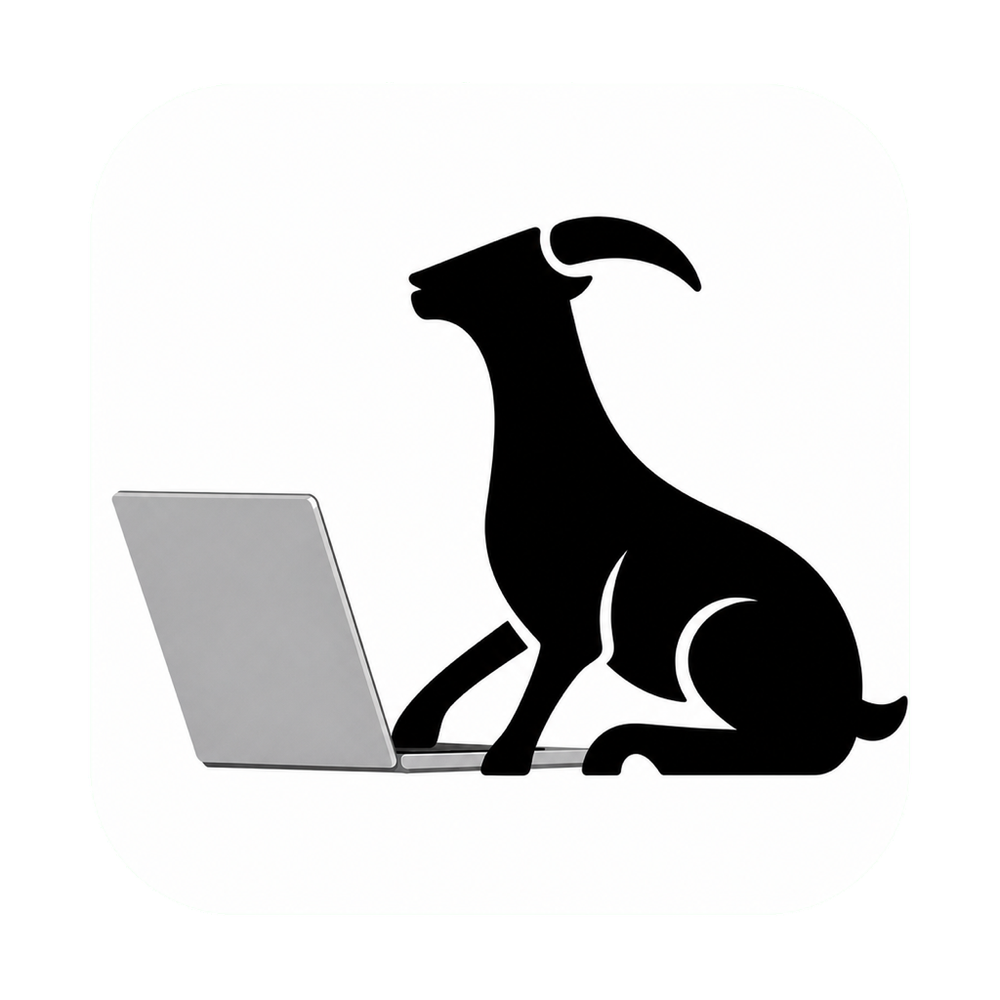

<p align="center">
  
</p>

<h1 align="center">ArchiGoat</h1>

<p align="center">
  Turn your own coding agent into a product studio.
</p>

<p align="center">
  <a href="https://github.com/VictorWen12/ArchiGoat/releases/latest/download/archigoat-macos.dmg"></a>
</p>

<p align="center">
  macOS 12+ · Apple Silicon and Intel · signed and notarized
</p>

<p align="center">
  <a href="LICENSE"></a>
</p>

## What is ArchiGoat

ArchiGoat is the desktop app where your own coding agent builds apps people can play.

ArchiGoat never sees your provider API keys. Sign-in runs each vendor's own official CLI login in the background — the vendor opens its own browser window — and ArchiGoat only reads that CLI's own logged-in evidence: `codex login status`, `claude auth status`, `cursor-agent status`.

## Features

- **Bring your own agent.** Codex (ChatGPT), Claude Code, and Cursor, each through its own official CLI login. No API keys stored by ArchiGoat.
- **Runs on your machine.** Work executes headlessly in a per-Work private workspace with immutable agent input.
- **Provider-native permissions.** ArchiGoat adds no sandbox or permission policy; each official CLI keeps its own defaults.
- **Survives restarts.** Journaled ordered provider events, restart recovery, and reattach to a still-running native runner.
- **Steer mid-run.** Send follow-up messages into a running Work without changing ownership.
- **Attach files and images** into a Work with byte receipts.
- **Verified delivery.** Artifacts are frozen to immutable, receipt-verified bytes before delivery; Done requires verified native evidence.
- **Result preview** for image, video, sandboxed HTML, PDF, and text, with Published vs Delivered state.
- **Remote control.** Start, steer, and stop a Work from your phone while ArchiGoat executes it on your computer and returns live progress and the result.
- **Silent signed self-update on macOS.** SHA-256 pinned, signature + team-id + version/commit verified, swapped atomically only when zero Works are active.
- **Loopback-only, single trusted origin.** The listener refuses to bind anything but `127.0.0.1`, every request carries a voucher, and your TrianGoat session lives in one owner-only app file, written `0600` and replaced atomically.
- **Clean uninstall.** `~/Applications/ArchiGoat.app/Contents/MacOS/archigoat --uninstall` releases launchd, retires the registration, clears the session, and deletes every file the app created — keeping only delivered artifacts.

## Direct Download

Download the signed, notarized macOS app directly. GitHub Releases remains the source of the published bytes and release history.

| Platform | Direct download | Build |
| --- | --- | --- |
| macOS 12+ | [Universal DMG ↓](https://github.com/VictorWen12/ArchiGoat/releases/latest/download/archigoat-macos.dmg) | Apple Silicon + Intel |

Each release lists the universal DMG and the `release.json` manifest used by the updater.

- **Universal** — one binary that runs natively on Apple Silicon and Intel.
- **Signed and notarized** — Developer ID, hardened runtime, secure timestamp, notarized and stapled. Installed apps update themselves.
- **macOS 12 (Monterey) or newer.**

Windows will appear here only after its signed installer is published.

### Install on macOS

1. Download and open the universal DMG.
2. Drag ArchiGoat into Applications and open it.
3. Sign in to TrianGoat, then connect your installed Codex, Claude Code, or Cursor CLI in Connections.

## Build from source

Requires Rust stable and Node 22+.

```bash
npm ci --prefix shell
npm run build --prefix shell
cargo build --locked --release --manifest-path daemon/Cargo.toml
cargo build --locked --release --manifest-path shell/src-tauri/Cargo.toml
```

A local build runs against the production server. Signed releases update themselves.

The signed, notarized DMG is produced in CI with `release/package-macos.sh` and Apple Developer ID credentials.

## Architecture

| Component | Job |
| --- | --- |
| `daemon/` | Account binding, phone pairing, mailbox poll, remote Work execution, updater |
| `shell/` | Composer, Work chat, progress, result view, provider and model selection, Publish, Connections |
| `release/` | macOS build, signing, notarization |

A Rust daemon on axum and tokio, and a React 19 + Vite 6 + TypeScript 5.9 shell in a Tauri 2 window, speaking loopback wire protocol v15.

## Contributing

Issues and pull requests are welcome at [github.com/VictorWen12/ArchiGoat/issues](https://github.com/VictorWen12/ArchiGoat/issues). `.github/workflows/app-ci.yml` builds the daemon and shell on macOS and runs the function tests in `test/` on every pull request — please make sure it passes.

## License

[Apache-2.0](LICENSE)
